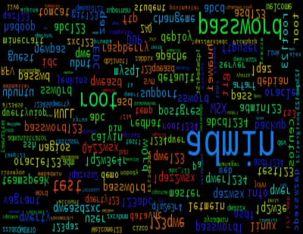
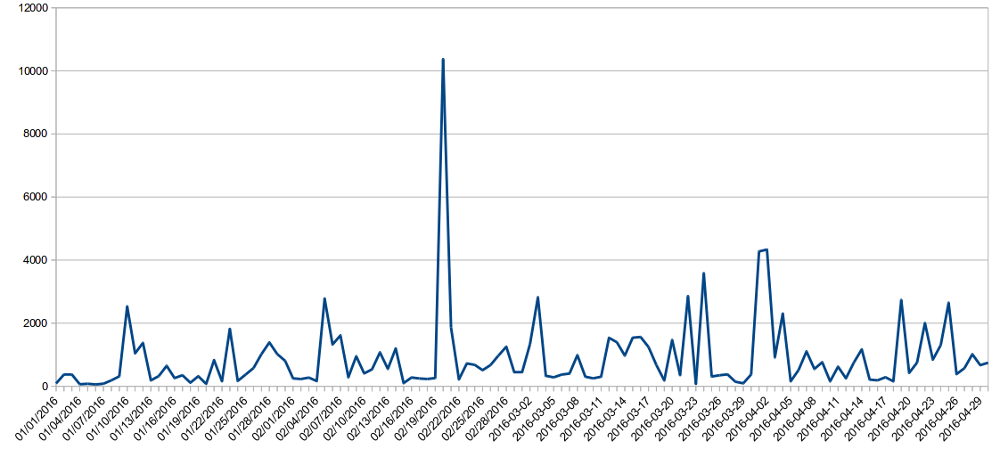
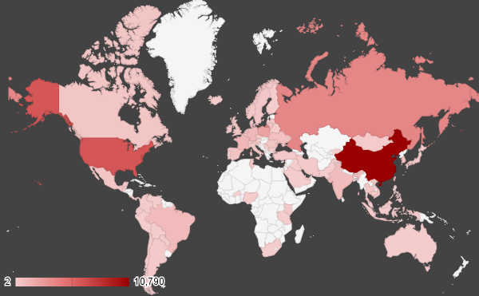

# honeylog2016

Honeypot log 2016

## Honeypots

* cowrie
* Dionaea
* glastopf

## cowrie


### Basic Results
```
Total entries = 9754
Total unique entries = 9693
```
### Top 10 passwords

```
zezewudi = 3 (0.03%)
12345 = 3 (0.03%)
123456 = 3 (0.03%)
admin = 3 (0.03%)
admin123 = 3 (0.03%)
admin1234 = 3 (0.03%)
password = 3 (0.03%)
qazwsx = 3 (0.03%)
rBtrn = 3 (0.03%)
root = 3 (0.03%)
```
### Top 10 base words
```
admin = 107 (1.1%)
root = 101 (1.04%)
test = 47 (0.48%)
password = 41 (0.42%)
abcd = 37 (0.38%)
qwer = 37 (0.38%)
pass = 29 (0.3%)
qwerty = 24 (0.25%)
qazwsx = 24 (0.25%)
asdf = 23 (0.24%)
```
### Password length (length ordered)
```
1 = 20 (0.21%)
2 = 95 (0.97%)
3 = 387 (3.97%)
4 = 713 (7.31%)
5 = 825 (8.46%)
6 = 1493 (15.31%)
7 = 1193 (12.23%)
8 = 1510 (15.48%)
9 = 1101 (11.29%)
10 = 822 (8.43%)
11 = 412 (4.22%)
12 = 478 (4.9%)
13 = 149 (1.53%)
14 = 122 (1.25%)
15 = 82 (0.84%)
16 = 72 (0.74%)
17 = 35 (0.36%)
18 = 39 (0.4%)
19 = 17 (0.17%)
20 = 36 (0.37%)
21 = 15 (0.15%)
22 = 10 (0.1%)
23 = 11 (0.11%)
24 = 14 (0.14%)
25 = 15 (0.15%)
26 = 10 (0.1%)
27 = 3 (0.03%)
28 = 5 (0.05%)
29 = 6 (0.06%)
30 = 2 (0.02%)
31 = 3 (0.03%)
32 = 22 (0.23%)
33 = 4 (0.04%)
34 = 2 (0.02%)
35 = 3 (0.03%)
36 = 3 (0.03%)
37 = 4 (0.04%)
38 = 1 (0.01%)
40 = 1 (0.01%)
41 = 1 (0.01%)
43 = 1 (0.01%)
44 = 2 (0.02%)
47 = 4 (0.04%)
48 = 2 (0.02%)
50 = 1 (0.01%)
51 = 2 (0.02%)
55 = 1 (0.01%)
56 = 1 (0.01%)
57 = 1 (0.01%)
63 = 1 (0.01%)
81 = 1 (0.01%)
100 = 1 (0.01%)
```
### Password length (count ordered)
```
8 = 1510 (15.48%)
6 = 1493 (15.31%)
7 = 1193 (12.23%)
9 = 1101 (11.29%)
5 = 825 (8.46%)
10 = 822 (8.43%)
4 = 713 (7.31%)
12 = 478 (4.9%)
11 = 412 (4.22%)
3 = 387 (3.97%)
13 = 149 (1.53%)
14 = 122 (1.25%)
2 = 95 (0.97%)
15 = 82 (0.84%)
16 = 72 (0.74%)
18 = 39 (0.4%)
20 = 36 (0.37%)
17 = 35 (0.36%)
32 = 22 (0.23%)
1 = 20 (0.21%)
19 = 17 (0.17%)
25 = 15 (0.15%)
21 = 15 (0.15%)
24 = 14 (0.14%)
23 = 11 (0.11%)
26 = 10 (0.1%)
22 = 10 (0.1%)
29 = 6 (0.06%)
28 = 5 (0.05%)
33 = 4 (0.04%)
37 = 4 (0.04%)
47 = 4 (0.04%)
31 = 3 (0.03%)
27 = 3 (0.03%)
35 = 3 (0.03%)
36 = 3 (0.03%)
34 = 2 (0.02%)
44 = 2 (0.02%)
48 = 2 (0.02%)
30 = 2 (0.02%)
51 = 2 (0.02%)
41 = 1 (0.01%)
63 = 1 (0.01%)
43 = 1 (0.01%)
40 = 1 (0.01%)
57 = 1 (0.01%)
56 = 1 (0.01%)
81 = 1 (0.01%)
38 = 1 (0.01%)
55 = 1 (0.01%)
100 = 1 (0.01%)
50 = 1 (0.01%)
```
```
      |                                                                 
      |                                                                 
      |                                                                 
     ||                                                                 
     |||                                                                
     |||                                                                
     |||                                                                
    ||||                                                                
   |||||                                                                
   |||||                                                                
   ||||| |                                                              
   |||||||                                                              
   |||||||                                                              
   |||||||                                                              
  |||||||||                                                             
||||||||||||||||||||||||||||||||||||||||||||||||||||||||||||||||||||||||
000000000011111111112222222222333333333344444444445555555555666666666677
012345678901234567890123456789012345678901234567890123456789012345678901
```
```
One to six characters = 3533 (36.22%)
One to eight characters = 6236 (63.93'%)
More than eight characters = 3518 (36.07%)

Only lowercase alpha = 3849 (39.46%)
Only uppercase alpha = 75 (0.77%)
Only alpha = 3924 (40.23%)
Only numeric = 416 (4.26%)

First capital last symbol = 70 (0.72%)
First capital last number = 250 (2.56%)

Single digit on the end = 545 (5.59%)
Two digits on the end = 191 (1.96%)
Three digits on the end = 1369 (14.04%)
```
### Last number
```
0 = 165 (1.69%)
1 = 435 (4.46%)
2 = 241 (2.47%)
3 = 1362 (13.96%)
4 = 284 (2.91%)
5 = 188 (1.93%)
6 = 199 (2.04%)
7 = 89 (0.91%)
8 = 116 (1.19%)
9 = 153 (1.57%)
```
```
   |                                                                    
   |                                                                    
   |                                                                    
   |                                                                    
   |                                                                    
   |                                                                    
   |                                                                    
   |                                                                    
   |                                                                    
   |                                                                    
 | |                                                                    
 | |                                                                    
 | ||                                                                   
 ||||||                                                                 
||||||||||                                                              
||||||||||                                                              
0123456789
```

### Last digit
```
3 = 1362 (13.96%)
1 = 435 (4.46%)
4 = 284 (2.91%)
2 = 241 (2.47%)
6 = 199 (2.04%)
5 = 188 (1.93%)
0 = 165 (1.69%)
9 = 153 (1.57%)
8 = 116 (1.19%)
7 = 89 (0.91%)
```
### Last 2 digits (Top 10)
```
23 = 1206 (12.36%)
34 = 160 (1.64%)
21 = 130 (1.33%)
56 = 125 (1.28%)
45 = 77 (0.79%)
12 = 58 (0.59%)
11 = 55 (0.56%)
00 = 48 (0.49%)
89 = 44 (0.45%)
88 = 39 (0.4%)
```
### Last 3 digits (Top 10)
```
123 = 1194 (12.24%)
234 = 157 (1.61%)
456 = 116 (1.19%)
321 = 115 (1.18%)
345 = 59 (0.6%)
789 = 34 (0.35%)
015 = 31 (0.32%)
111 = 28 (0.29%)
520 = 25 (0.26%)
888 = 25 (0.26%)
```
### Last 4 digits (Top 10)
```
1234 = 153 (1.57%)
3456 = 97 (0.99%)
2345 = 59 (0.6%)
2015 = 31 (0.32%)
4321 = 29 (0.3%)
1111 = 19 (0.19%)
3123 = 16 (0.16%)
6789 = 15 (0.15%)
4567 = 15 (0.15%)
3445 = 14 (0.14%)
```
### Last 5 digits (Top 10)
```
23456 = 97 (0.99%)
12345 = 59 (0.6%)
54321 = 21 (0.22%)
11111 = 15 (0.15%)
56789 = 15 (0.15%)
34567 = 14 (0.14%)
23445 = 14 (0.14%)
23123 = 14 (0.14%)
14520 = 12 (0.12%)
45678 = 12 (0.12%)
```
### Character sets
```
loweralpha: 3849 (39.46%)
loweralphanum: 2720 (27.89%)
loweralphaspecialnum: 804 (8.24%)
numeric: 416 (4.26%)
mixedalphanum: 291 (2.98%)
loweralphaspecial: 291 (2.98%)
mixedalpha: 278 (2.85%)
mixedalphaspecialnum: 211 (2.16%)
specialnum: 121 (1.24%)
upperalpha: 75 (0.77%)
upperalphanum: 70 (0.72%)
mixedalphaspecial: 55 (0.56%)
upperalphaspecial: 47 (0.48%)
upperalphaspecialnum: 40 (0.41%)
special: 36 (0.37%)
```
### Character set ordering
```
allstring: 4202 (43.08%)
stringdigit: 1881 (19.28%)
othermask: 1830 (18.76%)
alldigit: 416 (4.26%)
stringspecialdigit: 396 (4.06%)
stringdigitstring: 310 (3.18%)
digitstring: 278 (2.85%)
stringspecial: 129 (1.32%)
stringspecialstring: 128 (1.31%)
digitstringdigit: 68 (0.7%)
specialstring: 56 (0.57%)
allspecial: 36 (0.37%)
specialstringspecial: 24 (0.25%)
```








